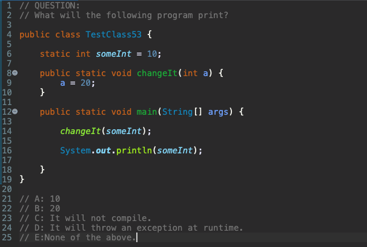

[comment]: # (This presentation was made with markdown-slides)
[comment]: # (This is a CommonMark compliant comment. It will not be included in the presentation.)
[comment]: # (Compile this presentation with the command below)
[comment]: # (mdslides presentation.md --include media)

[comment]: # (Set the theme:)
[comment]: # (THEME = white)
[comment]: # (CODE_THEME = base16/zenburn)
[comment]: # (The list of themes is at https://revealjs.com/themes/)
[comment]: # (The list of code themes is at https://highlightjs.org/)

[comment]: # "You can also use quotes instead of parenthesis"
[comment]: # "THEME = white"

[comment]: # (Pass optional settings to reveal.js:)
[comment]: # (controls: true)
[comment]: # (keyboard: true)
[comment]: # (markdown: { smartypants: true })
[comment]: # (hash: false)
[comment]: # (respondToHashChanges: false)
[comment]: # (Other settings are documented at https://revealjs.com/config/)

SD32 | Skill Distillery | March 24, 2022

# Methods

Andy Cary

[comment]: # (!!!)

### Definition

A method is a block of code defined within a class
- provides a way to **perform some task**
- only runs when it is called

You can pass data, known as parameters, into a method.

Also known as functions.

[comment]: # (!!!)

### Motivation

Why use methods?

**To reuse code**: define the code once, and use it many times.

[comment]: # (!!!)

### Basic Example

```
public class Programmer {
  void caffeinate() {
    System.out.println("I am drinking coffee!");
  }
}
```

[comment]: # (!!!)

### Method Declaration

*Required* elements:

1. Return type
2. Name
3. Parentheses: ()
4. Body between braces: {}

[comment]: # (!!!)

### Calling a method

```
caffeinate();
```

Prints: `I am drinking coffee!`

[comment]: # (!!!)

### Components

1. Modifiers
2. Return type
3. Name
4. Parameter list: ()
5. Exception list
6. Method body: {}

[comment]: # (!!!)

### Modifiers

Access specifiers:
```
public          Accessible by all classes
private         By all classes in which it is defined
protected       Within same package or subclasses in a different package
(default)       Same package only (no keyword)
```

Can have zero or more (optional):

```
static          Used for class methods
abstract        Used when not providing a method body
final           Cannot be overridden by a subclass
```

[comment]: # (!!!)

### Return

Methods must have a return type.

Return statement includes primitive or object to return.

`void` keyword is used if no value is returned (meaning "without contents"). Can use or omit `return;`

[comment]: # (!!!)

### Name

- Identifier may only contain letters, numbers, `$`, or `_`
- First character not allowed to be a number
- Reserved words not allowed (`byte`, `char`, `import`, etc.)
- By convention: begin with lowercase letter (although not required)

[comment]: # (!!!)

### Parameters

Information can be passed to methods as a parameter.

Parameters act as variables inside the method.

- Required
- If none, empty parenthesis: ()
- If multiple: comma-separated

[comment]: # (!!!)

When a parameter is passed to the method, it is called an argument.
```
public class Programmer {
  static void favoriteCup(String color) {
    System.out.println(color + " cup");
  }

  public static void main(String[] args) {
    favoriteCup("red");
    favoriteCup("blue");
    favoriteCup("green");
  }
}
// red cup
// blue cup
// green cup
```
`color` is a *parameter* while `red, blue, green` are *arguments*

[comment]: # (!!!)

### Exception List

Specifies the Exceptions Thrown by a Method
- lets a method further up the call stack handle an exception
- throws clause: `throws` keyword + exceptions thrown by that method
- goes after the method name and argument list and before the body
```
public void writeOrders() throws IOException { ... }
```

[comment]: # (!!!)

### Method Body

Method's code, including the declaration of local variables, is enclosed between braces `{}`.

```
void caffeinate() {
  // METHOD BODY
  String roast = "dark"; // LOCAL VARIABLE
  System.out.println("I am drinking " + roast + " coffee!");
  // I am drinking dark coffee!
}
```

[comment]: # (!!!)

### Overloading Methods

Java can distinguish between methods with different *method signatures*

Methods can have the same name if they have different parameter lists

[comment]: # (!!!)

```
public class Programmer {
    ...
    public void drink(String s) {
        // "I am drinking ESPRESSO"
    }
    public void drink(int i) {
        // "I am drinking 3 cups"
    }
}
```

Overloaded methods are differentiated by: **number** and the **type** of the arguments

Compiler does not consider return type when differentiating methods

[comment]: # (!!!)

### Pass by value

Java copies the value passed into a method
- "copy the value, and pass the copy"

```
int cups = 4;
makeCoffee(cups)

void makeCoffee(int mugs) {
   mugs = 8; // does NOT affect cups
}
```

[comment]: # (!!!)

### OCA Question



[comment]: # (!!!)

### Predefined Methods

Already defined in Java class libraries

```
main()
length()
equals()
compareTo()
sqrt()
max()
```

*User-defined* methods are written by the programmer according to requirements

[comment]: # (!!!)

### Static methods

*Static* methods can be called without creating an instance
- can access static members and change their values

```
public static void main(String[] args) { ... }
```

[comment]: # (!!!)

### Instance methods

*Instance* methods need an object of the class created before invoked or called
- **Accessor** methods: access instance variables; prefixed with `get`, a.k.a `getters`
- **Mutator** methods: read and modify instance variables; prefixed with `set`, a.k.a `setters`

[comment]: # (!!!)

### Abstract methods

*Abstract* methods are without implementation
- uses `abstract` keyword and have no body

```
abstract void roastBeans();  
```

[comment]: # (!!!)

### Factory methods

*Factory* methods return an object to the class to which it belongs
- all static methods are factory methods

```
NumberFormat obj = NumberFormat.getNumberInstance();
```

[comment]: # (!!!)

### Advantages of methods

Increases the **readability and understandability** of the method's purpose

Increases **re-usability** of the code and thus **reduce size** of the code

Complex problems can be **modularized**

Improves **ability test, debug and maintain** the code

[comment]: # (!!!)
